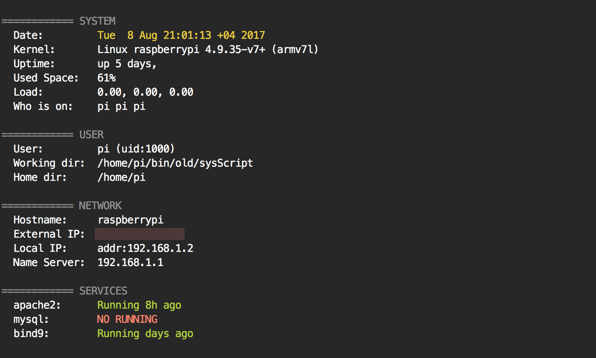

# sysScript
sys.sh is bash script gives useful quick system information on Linux OS like ubuntu, Raspbian, Debian. 

### Installation

```bash
$ git clone https://github.com/ffares/sysScript.git
```

### Usage

Using this script is very simple, just run this from the commnd line:

```bash
$ ./sys.sh
```

### Screenshot 


